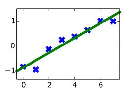

# Naked Tensor

This is a bare bottom example of *TensorFlow*, a machine learning package put together by Google. You will not find a simpler introduction to it.

In each example, a straight line is fit to some data. The slope and y-intercept of the line are determined using gradient descent. If you do not know about gradient descent, check out the Wikipedia page ([link](https://en.wikipedia.org/wiki/Gradient_descent)).

After creating the required variables, the error between the data and the line is *defined*. The definition of the error is then plugged into the optimizer. TensorFlow is then started and the optimizer is repeatedly called. This iteratively fits the line to the data.

Read the scripts in this order:
 * serial.py
 * tensor.py
 
## Requirements

 * TensorFlow (https://www.tensorflow.org/)
 * Python3 (https://www.python.org/)

## Serial.py

The purpose of this script is to illustrate the nuts and bolts of a TensorFlow model. The script makes it easy to understand how the model is put together. The error between the data and the line is defined using a for loop. Because of the way the error is defined, the calculation runs in serial.

## Tensor.py

This script goes a step farther than `serial.py` although it actually requires fewer lines of code. The outline of the code is the same as before except this time the error is defined using tensor operations. Because tensors are used, the code can run in parallel.

You see, each point of data is treated as being indepdent and identically sampled. Because each point of data is assumed to be independent, the calculations are too. When you use tensors, each point of data is run on separate computing cores. There are 8 points of data, so if you have a computer with eight cores it should run almost eight times faster. 

## Thanks

That's it. Hopefully you found this tutorial enlightening.

